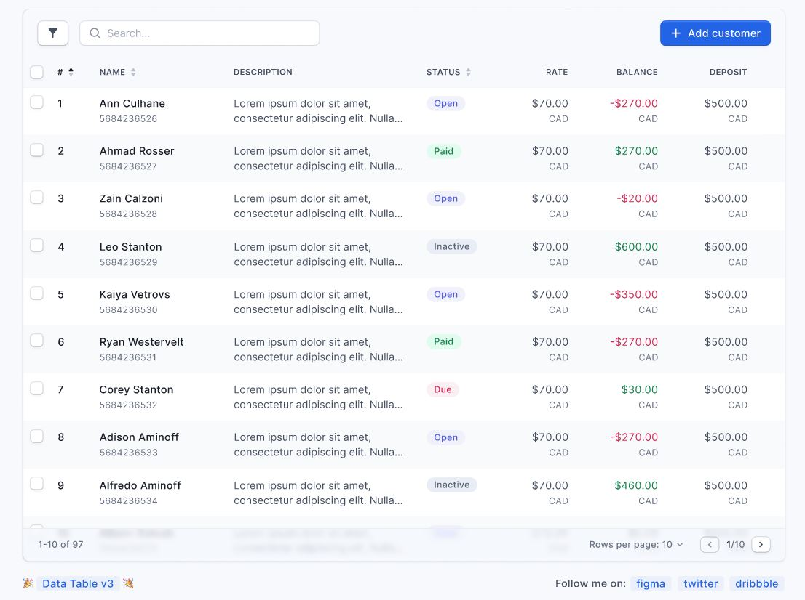

# Figma Wireframe Test Case & Test Script Generator using Gen AI

This project is a Gen AI application that generates **AI-enhanced Playwright TypeScript test scripts** and **human-readable test cases** from Figma wireframes. It integrates with the Figma API to extract UI elements and utilizes local Ollama AI models for intelligent test generation.

## Features

- **Figma API Integration**: Connects to Figma API to fetch UI elements from wireframes and designs
- **Smart UI Extraction**: Automatically detects and extracts UI components, including data tables with row-by-row analysis
- **AI-Enhanced Test Generation**: Uses local Ollama AI models (TinyLlama, Mistral, CodeLlama) for intelligent test script creation
- **Playwright TypeScript Tests**: Generates comprehensive test scripts with element existence, visibility, and text content verification
- **Human-Readable Test Cases**: Creates detailed Markdown documentation with test descriptions, steps, and expected results
- **Frame and Row Grouping**: Organizes tests by Figma frames and table rows for better structure
- **Multiple AI Models**: Choose between different AI models based on speed vs. quality requirements
- **User-Friendly Interface**: Streamlit-based web interface for easy configuration and result viewing

## Project Structure

```
figma-playwright-gen-ai/
├── src/
│   ├── main.py                           # Main Streamlit application
│   ├── figma_api/
│   │   ├── __init__.py
│   │   └── client.py                     # Figma API client
│   ├── ui_extractor/
│   │   ├── __init__.py
│   │   └── extractor.py                  # UI element extraction and table detection
│   ├── test_generator/
│   │   ├── __init__.py
│   │   ├── playwright_ts_generator.py    # TypeScript test script generation
│   │   └── markdown_generator.py         # Markdown test case generation
│   ├── ai_integration/
│   │   ├── __init__.py
│   │   └── ollama_llm.py                # Ollama AI integration
│   └── utils/
│       ├── __init__.py
│       └── helpers.py
├── output/                               # Generated test files (auto-created)
├── requirements.txt
└── README.md
```

## Prerequisites

### 1. Figma Setup
- **Figma Access Token**: Go to Figma → Settings → Account → Personal Access Tokens
- **Figma File Key**: Found in your Figma file URL: `https://www.figma.com/file/[FILE_KEY]/filename`
- **Figma Node Key**: Right-click frame → Copy Link → Extract node ID (format: `1376:2`)

### 2. Ollama AI Setup (Required)
This application requires Ollama to be running locally with at least one AI model installed.

```bash
# Install Ollama (visit https://ollama.ai for installation instructions)

# Start Ollama server
ollama serve

# Pull at least one AI model (choose based on your needs):
ollama pull tinyllama    # Fastest, basic quality
ollama pull mistral      # Balanced speed and quality (recommended)
ollama pull codellama    # Best quality, slower
```

## Installation

1. **Clone the repository:**
   ```bash
   git clone <repository-url>
   cd figma-playwright-gen
   ```

2. **Install Python dependencies:**
   ```bash
   pip install -r requirements.txt
   ```

3. **Verify Ollama is running:**
   ```bash
   curl http://localhost:11434/api/tags
   ```

## Usage

1. **Start the application:**
   ```bash
   streamlit run src/main.py
   ```

2. **Configure in the web interface:**
   - Enter your **Figma Access Token**
   - Enter your **Figma File Key**
   - Enter your **Figma Node Key** (format: `1376:2`)
   - Select your preferred **AI Model**:
     - **TinyLlama**: ~1-2 seconds per frame, basic quality
     - **Mistral**: ~3-5 seconds per frame, balanced quality (recommended)
     - **CodeLlama**: ~5-10 seconds per frame, best quality

3. **Generate tests:**
   - Click "🚀 Generate AI-Enhanced Tests"
   - Wait for AI processing (time varies by model and number of elements)
   - Review generated files in the `output/` directory

## Generated Files

The application creates two types of files for each frame/row:

### TypeScript Test Scripts
- **Location**: `output/[filekey]_[nodekey]_[framename]_test.ts`
- **Content**: Playwright TypeScript tests with:
  - Element existence verification
  - Visibility checks
  - Text content validation
  - Proper data-testid selectors
  - Error handling and comments

### Markdown Test Cases
- **Location**: `output/[filekey]_[nodekey]_[framename]_test_cases.md`
- **Content**: Human-readable test documentation with:
  - Test titles and descriptions
  - Step-by-step instructions
  - Expected results
  - Frame/row grouping information

## AI Models Comparison

| Model | Speed | Quality | Use Case |
|-------|-------|---------|----------|
| **TinyLlama** | ⚡ Fastest | Basic | Quick prototyping, simple tests |
| **Mistral** | ⚖️ Balanced | Good | Most production use cases |
| **CodeLlama** | 🐌 Slower | Best | Complex tests, production quality |

## Data Table Detection

The application automatically detects data tables in Figma frames when:
- Frame name contains "table", "data", "grid", "list", "row", "column"
- Frame name is exactly "Data table" (case-insensitive)
- Frame has multiple row-like child structures

For detected tables, separate test files are generated for each row.

## Troubleshooting

### Ollama Connection Issues
```bash
# Check if Ollama is running
curl http://localhost:11434/api/tags

# Start Ollama if not running
ollama serve

# Verify model is installed
ollama list

# Pull missing model
ollama pull mistral
```

### Character Encoding Issues
The application automatically handles Unicode characters and saves files with UTF-8 encoding to prevent character encoding errors on Windows systems.

### Generation Timeouts
- **TinyLlama**: 30 seconds timeout
- **Mistral**: 90 seconds timeout  
- **CodeLlama**: 150 seconds timeout

If generation times out, try switching to a faster model or check your system resources.

## Dependencies

- **streamlit**: Web interface framework
- **requests**: HTTP client for API calls
- **Local Ollama installation**: AI model inference

See `requirements.txt` for complete dependency list.

## License

This project is licensed under the MIT License. See the LICENSE file for more details.

## Demo

For the demo below, this figma wireframe was used: https://www.figma.com/community/file/786976918221602322/data-table

credit to the owner: [Alvish Baldha] (https://www.figma.com/@alvish)



App Demo:

